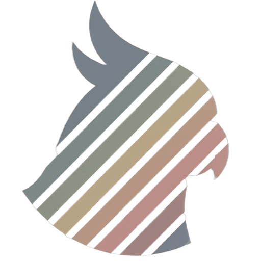
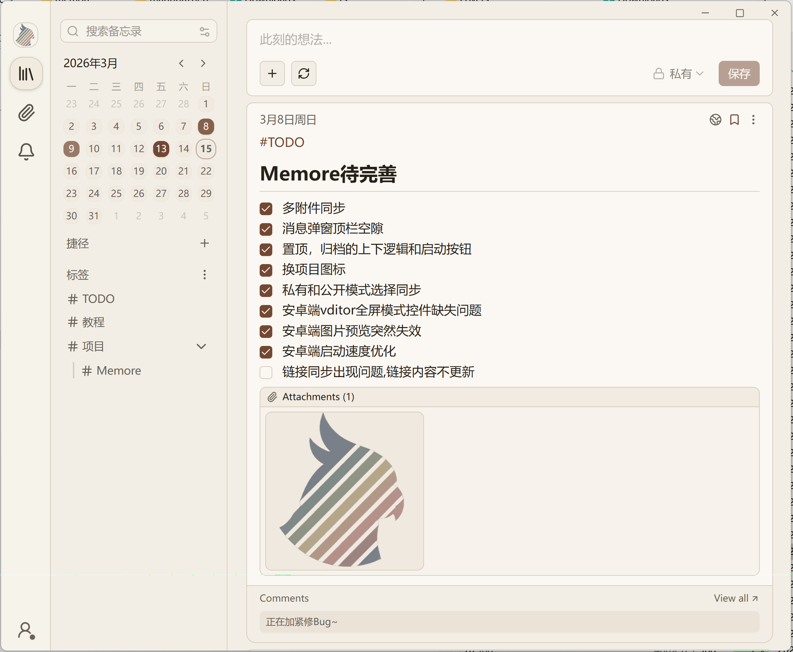
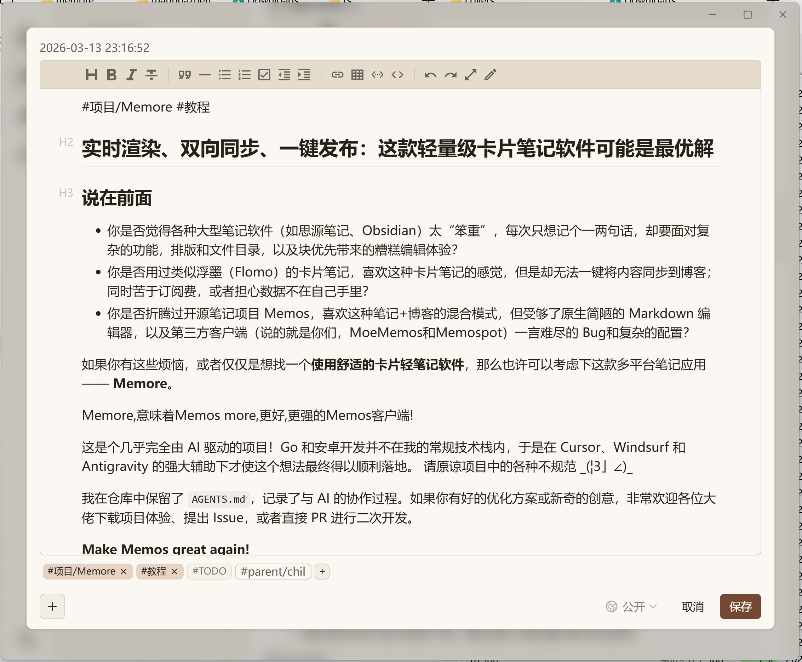
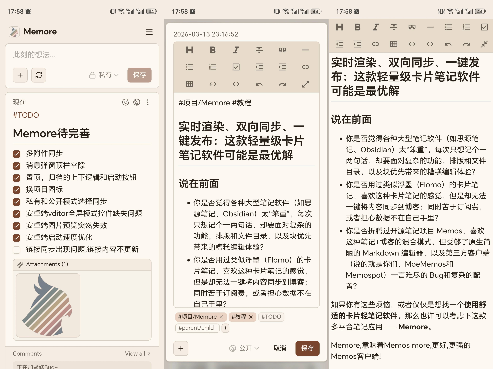

<h1 align="center">Memore</h1>

> Memos More — A local-first personal note-taking app built on Memos

---

Memore 是基于开源项目 [Memos](https://github.com/usememos/memos) 深度定制的**本地个人笔记应用**，起名为Memore, 意味着Memos more, 更好用更强大的Memos, 专为 Windows 和 Android 平台设计。在保留 Memos 核心能力的基础上，Memore 大幅优化了编辑体验、界面沉浸感和本地数据管理，同时支持与远端 Memos 服务器双向同步。

👉关于Memore的介绍、优势和使用方法，请看这篇文章：[Memore详细介绍](https://memos.nuonuo.tech/memos/MrCaeWF4qtu46k4U2Ldbog)

这是个几乎完全由 AI 驱动的项目！Go 和安卓开发并不在我的常规技术栈内，于是在 Cursor、Windsurf 和 Antigravity 的强大辅助下才使这个想法最终得以顺利落地.
请原谅项目中的各种不规范 \_(¦3」∠)_

我在仓库中保留了 `AGENTS.md`，记录了与 AI 的协作过程与提示词逻辑。如果你有好的优化方案或新奇的创意，非常欢迎 Fork 项目进行二次开发，或者直接提交 PR。期待各位的参与\~

Memore — Memos more .It is a local-first personal note-taking app for **Windows** and **Android**, built on the open-source [Memos](https://github.com/usememos/memos) project. It features an enhanced Vditor Markdown editor, bidirectional sync with remote Memos instances, and a native desktop/mobile experience.  

This is a project driven almost entirely by AI! Go and Android development are outside my usual tech stack, so it was the powerful assistance of Cursor, Windsurf, and Antigravity that finally brought this idea to life.

Please forgive any unconventional coding practices in the project  \_(¦3」∠)\_

I've kept the `AGENTS.md` file in the repository, which documents the AI collaboration process and prompt logic. If you have any brilliant optimization solutions or creative ideas, you are more than welcome to Fork the project for secondary development or submit a PR directly. Looking forward to your contributions~

Current version: **v0.3.0**

## 核心特性 - Key Features

本地优先,增强编辑器,云端同步,Windows&Android双端应用,附件下载保存...

详情参见Memore详细介绍和中文和英文完整文档

Local-first, enhanced editor, cloud sync, dual-platform app for Windows & Android, attachment download & save...

For details, see the Memore introduce or full documentation in both Chinese and English.  

## 参考文档 - Quick Links

- [Memore详细介绍](https://memos.nuonuo.tech/memos/MrCaeWF4qtu46k4U2Ldbog)

- [English Documentation](README.en.md) — Full feature list, setup guide, and configuration

- [中文文档](README.zh-CN.md) — 完整功能介绍、安装指南和配置说明

- [Windows Desktop Build Guide](packaging/windows/README.md)

- [Android Build Guide](packaging/android/README.md)

## 软件图片 - Pictures







## 快速开始 - Quick Start

使用打包好的Windows和Android软件,或者...

```powershell
# Windows desktop
.\scripts\build-desktop.ps1

# Android
.\scripts\build-android.ps1

# Web development
go run ./cmd/memos --port 8081
cd web && pnpm install && pnpm dev
```

## 致谢 - Credits

Built on [Memos](https://github.com/usememos/memos) (MIT License). Editor powered by [Vditor](https://github.com/Vanessa219/vditor).
